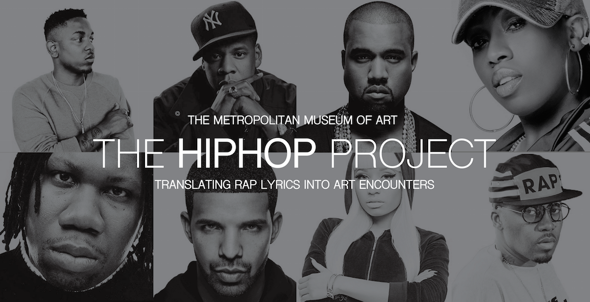

# The Hip Hop Project: Translating Rap Lyrics into Art Encounters

[http://www.rappersdelight.nyc/splash.html](http://www.rappersdelight.nyc/splash.html)

The Hip Hop Project is a web-based application that uses the words from rap lyrics as key-word searches into the Met's digital archive to allow users to experience a curated "tour" of the work at the Metropolitan Museum of Art. This project engages visitors who love rap music and provides them with a unique lens through which to view the museum's collection. 

